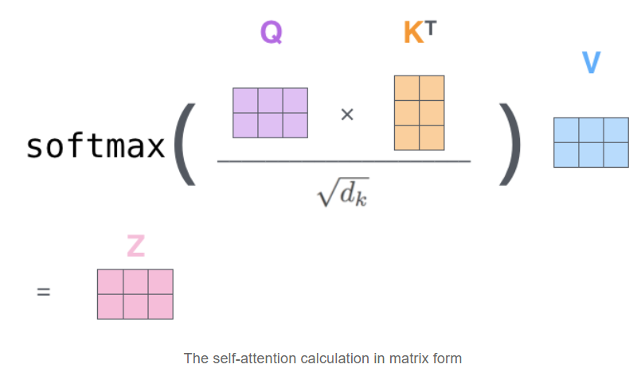

# Transformers in NLP

In this note book we will be look in very close details of the famous **transformer** as proposed in the paper [Attention Is All You Need](https://arxiv.org/abs/1706.03762). To accompany the digestion, we will also be looking at how **attention mechanism** works in deep learning and finally implement transformer with **transfer learning** with FastAI library.


## Contents

[***Overview***](https://sylar257.github.io/Transformers-in-NLP#overview): Current research trends, incentives of this repo, and our objectives

[***Model selection***](https://sylar257.github.io/Transformers-in-NLP#model_selection): Given so many high performance models, how do we choose which one to use?

[***Self-Attention***](https://sylar257.github.io/Transformers-in-NLP#self-attention): How the self-attention block works in deep learning architectures

[***Positional Encoding***](https://sylar257.github.io/Transformers-in-NLP#positional_encoding): Representing the order of the sequence using positional encoding

[***Residual connection***](https://sylar257.github.io/Transformers-in-NLP#residuals): Residuals are implemented for better learning efficiency and loss convergence

[***Implementation***](https://sylar257.github.io/Transformers-in-NLP#Code_Implementation): Implement transformer with transfer learning on IMDB sentiment analysis dataset

## Overview

[*Jeremy Howard*](https://medium.com/@jeremyphoward) and [Sebastian Ruder](https://medium.com/@sebastianruder) first introduced **transfer learning** with NLP in the [ULMFiT paper](https://arxiv.org/pdf/1801.06146.pdf) and implemented the technique with the [FastAI](https://www.fast.ai/) library. 

For details of implementation of FastAI-NLP please refer to the [fast.ai course](https://course.fast.ai/videos/?lesson=4) or my two previous repos: [ULMFiT-Sentiment-Analysis](https://github.com/Sylar257/ULMFiT-Sentiment-Analysis) and [Non-English-language-NLP](https://github.com/Sylar257/Non-English-language-NLP).

In traditional NLP research, **transfer learning** was long reckoned as not applicable even after it’s great success in the computer vision research. For a long time, NLP was though as special and needs to be treated with special care even when it comes to deep learning solution implementation. Hence, nobody published anything about transfer learning for NLP until Jeremy et al. proved to the crowd that *"transfer learning is nothing specific to the computer vision domain”* and this whole kicked off. The recent NLP academic trend has began to shift towards transfer learning as the time-saving and learning efficiency boost is quite obvious.

Big name companies has continued to push this technique further with **transfer learning** applied with more sophisticated architectures at larger scales: Google(BERT, Transformer-XL, XLNet), Facebook(RoBERTa, XLM) and OpenAI(GPT, GPT-2). 

FastAI library itself comes only with [AWS-LSTM](https://arxiv.org/abs/1708.02182), [Transformer](https://arxiv.org/abs/1706.03762) and [Transformer-XL](https://arxiv.org/abs/1901.02860). If we want to implement more advanced models(such as BERT or RoBERTa) while still enjoy the fast-prototyping and massive optimization offered by `FastAI`, we need to learn to integrate the two.

More specifically, we are going integrate `FastAI` and the `transformers` library developed by *[Hugging Face](https://huggingface.co/)*, formerly known as `pytorch-transformers` and `pytorch-pretrained-bert`. Now this library contains over 40 *state-of-the-art* **pre-trained** NLP models which we simply can’t pass on. It also come with essential utilities such as *tokenizer*, *optimizer* and *learning rate scheduler*. However, in this repo, we will use most of utility functions from `fastai` library as it’s a bit more optimized.

## Code Implementation

You will find **three** Jupyter notebooks in this repo. In the [Transformer with no LM fine-tuning.ipynb](https://github.com/Sylar257/Transformers-in-NLP/blob/master/Transformer%20with%20no%20LM%20fine-tuning.ipynb) we will implement transformer with `FastAI` library without fine-tuning the language model separately. This notebook follows strictly the guide provided by [Maximilien Roberti](https://towardsdatascience.com/@maximilienroberti). Details of his guide can be found both in his [Medium post](https://towardsdatascience.com/fastai-with-transformers-bert-roberta-xlnet-xlm-distilbert-4f41ee18ecb2) as well as [Kaggle chanllange](https://www.kaggle.com/maroberti/fastai-with-transformers-bert-roberta). (Thumbs up for Maximilien Roberti)

The reason why there exists a second notebook is because in Maximilien’s [implementation](https://www.kaggle.com/maroberti/fastai-with-transformers-bert-roberta) he mainly replaced the AWD_LSTM model from `FastAI` by **RoBERTa** from `Hugging Face`. According to Jeremy’s [ULMFiT paper](https://arxiv.org/pdf/1801.06146.pdf), if we’d fine tuning the encoder of the **RoBERTa** model as a language model before constructing the classifier for sentiment analysis task the accuracy could be even better. Hence, in the [Implement various Transformers with FastAI.ipynb](https://github.com/Sylar257/Transformers-in-NLP/blob/master/Implement%20various%20Transformers%20with%20FastAI.ipynb) you will find the complete code for building two separate `databunch` for both language model and classification task as well as how can we apply *transfer learning* with `transformers` while taking advantage of the convenience of `FastAI` toolkit.

Lastly, there is a new promising model coming out as I am creating this repository: **ALBERT**. Since the name is pretty cool(and it definitely has some attractive trait, see next section), let’s take it out for a spin. This model is also trained with `FastAI` library’s infrastructure and it is expected to out-perform **RoBERTa** as advertised in it’s [original paper](https://arxiv.org/pdf/1909.11942v4.pdf)

To benchmark our result we will be using the classic [IMDb sentiment analysis dataset](https://ai.stanford.edu/~ang/papers/acl11-WordVectorsSentimentAnalysis.pdf). Following the standard ULMFiT approach, in the last [repo](https://github.com/Sylar257/ULMFiT-Sentiment-Analysis), we were able to reach **94.7%** accuracy which is slightly better than the state-of-the-art result in 2017 (94.1% accuracy). Now let’s challenge ourselves to push these results even further by implementing more advanced skills.

In this repository you will find everything you need to incorporate transformers as the base architecture when using the `FastAI` framework. I will also try to provide you with the essential explanations of why we would make those customizations so that when you choose a different architecture you can replicate the process.

## Model_selection

*BERT, GPT, GPT-2, Transformer-XL, XLNet, XLM, RoBERTa, DistilBERT, ALBERT, XLM-RoBERTa*, *ALBERT*, the list goes on. There are so many good performing NLP models out there all available with pre-trained weight on huge datasets. I could be overwhelming to decide which model to use. While this repo focuses on the Transformer family, here is come quick tips towards choosing your model.

**BERT** is certainly outperforming several NLP models that was previously state-of-the-art. Its performance improvement is largely attributed to its bidirectional transformer using Masked Language Model. **RoBERTa**, **DistilBERT** and **XLNet** are three powerful models that are popularly used and their various versions are available in `Hugging Face`. **RoBERTa** is a retraining of **BERT** with 1000% more training data and stronger compute power. In addition, dynamic masking is used during training. **DistilBERT** trains similarly to **BERT** but it has only half the number of parameters by using a technique called distillation. **DistilBERT** is not necessary more accurate then its counterparts but it requires less time to train and it’s faster during inference time. **XLNet** is the heavy weight player, it’s trained with larger datasets with much stronger computing power and longer time (about 5 times more than **BERT**). Moreover, during training time, **XLNet** doesn’t adopt masked language model, unlike **BERT**/**RoBERTa**/**DistilBERT**/**ALBERT**, but uses permutation language modeling where all tokens are predicted but in random order. The benefit of this is that the model could potentially learn the dependencies between all words. (with masked language model, dependencies between masked words are lost) Lastly, **ALBERT** from Google is another new power player in town. As compared to its peers, **ALBERT** is famous for having outstanding performance with much less parameters. More specifically, the authors adopted *factorized embedding parameterization* to decompose large vocabulary embed matrix into two small matrices. In addition, *cross-layer parameter sharing* was used so that we don’t have to learn **11 bert-encoder weights** (we only need update one). There is an update on *inter-sentence coherence loss*, however, **ALBERT** still uses MLM training.

#### Conclusion

**BERT**/**RoBERTa** are very good baseline models are should perform fairly well for most NLP tasks. **XLNet**’s permutation based training could potentially give us a performance boost but the fine-tuning and inference  takes more time. If we want fast inference speed, go for **DistilBERT**. **ALBERT** offers fasted training as it has the smallest parameters to update considering same model scale.


# Transformer Key Elements

## Self-Attention

This is probably one of the most important concept to understand when come to learning Transformer.

Say that we want to translate this sentence to Chinese:

*"The cat can’t jump onto the table because it’s too tall”* 

What does 'it’ refers to in this sentence? Does it refer to the *cat* or the *table*? To human, this is such a simple question but not as simple to an algorithm.

At the high-level, **Self-attention** allows the algorithm to associate '*it*' to '*cat*'. As the model processes each word (each position in the input sequence), self attention allows it to look at other positions in the input sequence for clues that can help lead to a better encoding for this word.

### Self-attention: step one

The first step of calculating self-attention is to create three vectors from each of the encoder’s input vectors (this would be the **embeddings** of the words). Hence, we create a **Query vector**, a **Key vector**, and a **Value vector** for each word. These vectors are created by *multiplying* the embeddings by three matrices that we trained during the *training process*.


What are the “query”, “key”, and “value” vectors?

They’re abstractions that are useful for calculating and thinking about **attention**. Once you proceed with reading how attention is calculated below, you’ll know pretty much all you need to know about the role each of these vectors plays.

### Self-attention: step two

With “query”, “key”, and “value”, we can compute a **score** for each word in the *input sentence*. The score determines how much focus to place on other parts of the **input sentence** as we encode a word at the given position.



This "**Z**" score can be thought as to give us a score distribution that represents the attention the network has over all other word in the input sentence.

## Multi-headed attention

This is another mechanism introduced by the authors to further improve the performance of the attention layers. It has mainly two effects:

1. It expands the model’s ability to focus on different positions. Yes, in the example above, "**Z**" contains a little bit of every other encoding, but it could be *dominated* by the actual word itself (thanks to the *softmax*). It would be useful if we’re translating a sentence like *"The cat can’t jump onto the table because it’s too tall”* , when the algorithm knows what the word "it’s” is referring to.
2. It give the attention layer multiple "representation subspaces”. As we will see for the illustration below, with multi-headed attention we have not only one, but multiple sets of **Query/Key/Value** weight matrices (the **Transformer** uses **eight** attention heads, so we end up with eight sets for each encoder/decoder). Each of these sets is randomly initialized. Then, after training, each set is used to project the input embeddings (or vectors from lower encoders/decoders) into a different representation subspace.


If we do the same **self-attention** calculation we outlined above, just eight different times with different weight matrices we end up with eight different **"Z”** matrices:


This leaves us with a bit of a challenge. The following layers is not expecting eight matrices — they are expecting a single matrix that contains a score for each word. So we need a way to *condense* these eight down to a single matrix. Solution: concatenate the matrices then use a another network to project it to the right shape:


## The overall picture of self-attention

Finally, when we put everything together.


# Positional_Encoding

One thing that’s missing from the model is the ability to locate the word’s position in the sentence.

To address this, the transformer adds a **vector** to each input embedding. These vectors follow a specific pattern that the model **learns**, which helps it determine the position of each word, or the distance between different words in the sequence. The intuition here is that adding these values to the embeddings provides meaningful distances between the embedding vectors once they’re projected into **Q/K/V** vectors and during dot-product attention.


If we assumed the embedding has a dimensionality of *4*, the actual positional encodings would look like this:


# Residuals

Similar to the **ResNet**, in the transformer’s encoder architecture there are *residual connections*. In each encoder, there is a residual connection around it, and is followed by a [layer-normalization](https://arxiv.org/abs/1607.06450) step. If we visualize the architecture is looks like this:


**"X”** vector is the [positional encoding](https://github.com/Sylar257/Transformers-in-NLP#positional_encoding).

## Overall_structure

Of course, the layers are stacked for the **transformer**. We have **6-layer-stacking** for both *encoder* and *decoder* by the design of the [original paper](https://arxiv.org/abs/1706.03762). For illustration, if have a transformer of 2-layer-stacking:


## Code_Implementation

You will find two Jupyter notebooks in this repo. In the [**Transformer with no LM fine-tuning.ipynb**](https://github.com/Sylar257/Transformers-in-NLP/blob/master/Transformer%20with%20no%20LM%20fine-tuning.ipynb) we will implement transformer with `FastAI` library without fine-tuning the language model separately. This notebook follows strictly the guide provided by [Maximilien Roberti](https://towardsdatascience.com/@maximilienroberti). Details of his guide can be found both in his [Medium post](https://towardsdatascience.com/fastai-with-transformers-bert-roberta-xlnet-xlm-distilbert-4f41ee18ecb2) as well as [Kaggle chanllange](https://www.kaggle.com/maroberti/fastai-with-transformers-bert-roberta). (Thumbs up for Maximilien Roberti)

The reason why there exists a second notebook is because in Maximilien’s [implementation](https://www.kaggle.com/maroberti/fastai-with-transformers-bert-roberta) he mainly replaced the AWD_LSTM model from `FastAI` by **RoBERTa** from `Hugging Face`. According to Jeremy’s [ULMFiT paper](https://arxiv.org/pdf/1801.06146.pdf), if we’d fine tuning the encoder of the **RoBERTa** model as a language model before constructing the classifier for sentiment analysis task the accuracy could be even better. Hence, in the [**Transformer training with Language model tuning.ipynb**](https://github.com/Sylar257/Transformers-in-NLP/blob/master/Transformer%20training%20with%20Language%20model%20tuning.ipynb) you will find the complete code for building two separate `databunch` for both language model and classification task as well as how can we apply *transfer learning* with `transformers` while taking advantage of the convenience of `FastAI` toolkit.

To benchmark our result we will be using the classic [IMDb sentiment analysis dataset](https://ai.stanford.edu/~ang/papers/acl11-WordVectorsSentimentAnalysis.pdf). Following the standard ULMFiT approach, in the last [repo](https://github.com/Sylar257/ULMFiT-Sentiment-Analysis), we were able to reach **94.7%** accuracy which is slightly better than the state-of-the-art result in 2017 (94.1% accuracy). Now let’s challenge ourselves to push these results even further by implementing more advanced skills.

In this repository you will find everything you need to incorporate transformers as the base architecture when using the `FastAI` framework. I will also try to provide you with the essential explanations of why we would make those customizations so that when you choose a different architecture you can replicate the process.

#### Walkthrough of 3 notebooks

[***RoBERTa without LM tuning***](https://github.com/Sylar257/Transformers-in-NLP#RoBERTa_without_LM_fine-tuning): Training RoBERTa sequence classifier without fine-tuning the language model

[***RoBERTa with ULMFiT***](https://github.com/Sylar257/Transformers-in-NLP#roberta_ULMFiT): Follow ULMFiT strategy by fine-tuning RoBERTa using Masked Language Modeling before training the actual sequence classifier

[***ALBERT***](https://github.com/Sylar257/Transformers-in-NLP#XLNet): Fine tuning ALBERT for IMDb sentiment analysis


### RoBERTa_without_LM_fine-tuning

When using the pre-trained models from `transformer` library, each model architecture need the following information:

1. A **model class** too lead/store a particular pre-trained model.
2. A **tokenizer class** to pre-process the data and make it compatible with our model of selection
3. A **configuration class** to load/store the configuration of a particular model

We will start with the [**RoBERTa** transformer](https://ai.facebook.com/blog/roberta-an-optimized-method-for-pretraining-self-supervised-nlp-systems/) from Facebook. To incorporate customized model with `FastAI` is not as simple as plugging in the model architecture into the `Learner`. We have to construct the proper dataloader(in `FastAI` known as `databunch`) so that the transformer is getting what its expecting to get.

#### Step.1 Customize our processors:

The important thing here is that `FastAI` uses processors to perform repetitive tasks when creating DataBunch. A set of default processors are performed for [fastai.textlearners](https://github.com/fastai/fastai/blob/67308f15394bd8189eb9b3fbb3db770c6c78039e/fastai/text/data.py#L283). For example:

```python
# FastAI use various processors to perform repeatative tasks in data pipeline

def _get_processor(tokenizer:Tokenizer=None, vocab:Vocab=None, chunksize:int=10000, max_vocab:int=60000,
                   min_freq:int=2, mark_fields:bool=False, include_bos:bool=True, include_eos:bool=False):
    return [TokenizeProcessor(tokenizer=tokenizer, chunksize=chunksize, 
                              mark_fields=mark_fields, include_bos=include_bos, include_eos=include_eos),
            NumericalizeProcessor(vocab=vocab, max_vocab=max_vocab, min_freq=min_freq)]
```

Here two default processors are invoked: tokenizer and numericalizer. The two classes are defined as such:

```python
class TokenizeProcessor(PreProcessor):
    "`PreProcessor` that tokenizes the texts in `ds`."
    def __init__(self, ds:ItemList=None, tokenizer:Tokenizer=None, chunksize:int=10000, 
                 mark_fields:bool=False, include_bos:bool=True, include_eos:bool=False):
        self.tokenizer,self.chunksize,self.mark_fields = ifnone(tokenizer, Tokenizer()),chunksize,mark_fields
        self.include_bos, self.include_eos = include_bos, include_eos

    def process_one(self, item):
        return self.tokenizer._process_all_1(_join_texts([item], self.mark_fields, self.include_bos, self.include_eos))[0]

    def process(self, ds):
        ds.items = _join_texts(ds.items, self.mark_fields, self.include_bos, self.include_eos)
        tokens = []
        for i in progress_bar(range(0,len(ds),self.chunksize), leave=False):
            tokens += self.tokenizer.process_all(ds.items[i:i+self.chunksize])
        ds.items = tokens

class NumericalizeProcessor(PreProcessor):
    "`PreProcessor` that numericalizes the tokens in `ds`."
    def __init__(self, ds:ItemList=None, vocab:Vocab=None, max_vocab:int=60000, min_freq:int=3):
        vocab = ifnone(vocab, ds.vocab if ds is not None else None)
        self.vocab,self.max_vocab,self.min_freq = vocab,max_vocab,min_freq

    def process_one(self,item): return np.array(self.vocab.numericalize(item), dtype=np.int64)
    def process(self, ds):
        if self.vocab is None: self.vocab = Vocab.create(ds.items, self.max_vocab, self.min_freq)
        ds.vocab = self.vocab
        super().process(ds)
```

This is our IMDb text after tokenized with `Fastai` default tokenizer:


and this is IMDb text tokenized with `transformer` `RoBERTa` tokenizer:


It’s easy to see that the `Hugging Face` `RoBERTa` is expecting different tokenization and that we need to customize the processors. What we need to do is essentially grab the tokenizer, vocabulary, special tokens and numericalizer from `Hugging Face` and put the `FastAI` wrapper on to make it a compatible class. Detail of these step please refer to the [Jupyter notebook](https://github.com/Sylar257/Transformers-in-NLP/blob/master/Transformer%20with%20no%20LM%20fine-tuning.ipynb).

#### Step.2 Create Our `DataBunch` for classification:

We can easily find the IMDb dataset once we installed the `FastAI` library by calling `untar_data(URLs.IMDb)`. This would return us a `PosixPath` object under which path we can find three useful files: *train, test and unsup.*

In this notebook, we are going to ignore the *unsup* folder and construct `DataBunch` only using *train* and *test* folders. 

**\*Note that for `transformer_processor` we need to include `OpenFileProcessor()`. This is because we are reading from different folders instead of straight from dataframes or .csv files.**

```python
# processors need to be in the right order
transformer_processor = [OpenFileProcessor(),tokenize_processor, numericalize_processor]
```

Then create our `DataBunch`:

```python
# we can play around with the batch_size as long as the GPU can take it
bs = 16
data_clas = (TextList.from_folder(path, vocab=transformer_vocab, processor=transformer_processor)                       # specify the path
           .filter_by_folder(include=['train','test']) # exclude other folders
           .split_by_folder(valid='test')              # split by train and valid folder (that only keeps 'train' and 'test' so no need to filter)
           .label_from_folder(classes=['neg', 'pos'])  # label them all with their folders
           .databunch(bs=bs))                          # convert to databunch for the learner later
```

#### Step.3 Create our customized transformer model:

This step is quite straight forward. Get the model architecture itself provided by `Hugging Face` and make sure the `forward` function provides the right information. 

```python
# defining our model architecture 
class CustomTransformerModel(nn.Module):
    def __init__(self, transformer_model: PreTrainedModel):
        super(CustomTransformerModel,self).__init__()
        self.transformer = transformer_model
        
    def forward(self, input_ids, attention_mask=None):
        
        #attention_mask = (input_ids!=1).type(input_ids.type()) # Test attention_mask for RoBERTa
        
        logits = self.transformer(input_ids,
                                attention_mask = attention_mask)[0]   
        return logits

# hyper parameter setup
config = config_class.from_pretrained(pretrained_model_name)
config.num_labels = 2
    
    
# Create customized transformer model
transformer_model = model_class.from_pretrained(pretrained_model_name, config = config)
custom_transformer_model = CustomTransformerModel(transformer_model = transformer_model)
```

Pay attention to what the `forward` function returns as we will be modifying this part once we get to the [next notebook](https://github.com/Sylar257/Transformers-in-NLP/blob/master/Transformer training with Language model tuning.ipynb) and start to build language models. We should also get the *hyper-parameters* provided by `Hugging Face` by calling `config_class.from_pretrained(pretrained_model_name)`. Change the `config.num_label = 2` as we only have **positive** or **negative** in IMDb prediction and then we are good to go.

#### Step.4 Create Learner object:

A `DataBunch` and a `architecure` are two object we must provide in order to create a `Learner` object in `FastAI`. There is one more thing we consider specify here that is our optimizer. `FastAI` uses [AdamW](https://www.fast.ai/2018/07/02/adam-weight-decay/#adamw) by default and it was pointed out by Maximilien that for reproducing *BertAdam* specific behavior we have to set `correct_bias = False`. Hence we use the `partial( )` function:

```python
# customize AdamW
CustomAdamW = partial(AdamW, correct_bias=False)

# Create learner
learner = Learner(data_clas, 
                  custom_transformer_model, 
                  opt_func = CustomAdamW, 
                  metrics=[accuracy, error_rate])

# Show graph of learner stats and metrics after each epoch.
learner.callbacks.append(ShowGraph(learner))
```

We are also going to split the layers. `FastAI` employs the concept of layer groups in that we divide our layers into a few groups so that later we **have the freedom to freeze/unfreeze their weight or applier different learning rates for different layer groups**.

```python
# For roberta-base
list_layers = [learner.model.transformer.roberta.embeddings,
              learner.model.transformer.roberta.encoder.layer[0],
              learner.model.transformer.roberta.encoder.layer[1],
              learner.model.transformer.roberta.encoder.layer[2],
              learner.model.transformer.roberta.encoder.layer[3],
              learner.model.transformer.roberta.encoder.layer[4],
              learner.model.transformer.roberta.encoder.layer[5],
              learner.model.transformer.roberta.encoder.layer[6],
              learner.model.transformer.roberta.encoder.layer[7],
              learner.model.transformer.roberta.encoder.layer[8],
              learner.model.transformer.roberta.encoder.layer[9],
              learner.model.transformer.roberta.encoder.layer[10],
              learner.model.transformer.roberta.encoder.layer[11],
              learner.model.transformer.roberta.pooler]

# use the defaul split function from Learner class
learner.split(list_layers)
```

#### Step.5 Training

Yeah! After all the hard work of setting things up, our favorite part of deep learning has come!

We are going to start with a frozen model by calling `learner.freeze()` , find the optimal learning rate `learner.lr_find()` and `learner.recorder.plot(skip_end = 10, suggestion=True)` and finally `learner.fit_one_cycle()` to do *learning rate annealing*.


As suggested by Jeremy Howard in his [ULMFiT paper](https://arxiv.org/pdf/1801.06146.pdf) we consider gradually unfreeze the layers 2 groups at a time, and repeat the above process.

We are able to achieve **95.3%** accuracy which higher than the **94.1%** (2017 state-of-the-art) and **94.7%** ULMFiT with AWD_LSTM bacs architecture.


## RoBERTa_ULMFiT

We have seen the [**the first notebook**](https://github.com/Sylar257/Transformers-in-NLP/blob/master/Transformer%20with%20no%20LM%20fine-tuning.ipynb) that by training a RoBERTa for sequence classification performs significantly better than the ULMFiT with AWD_LSTM. At point, we are naturally curious about what happens if we apply the ULMFiT training stratgy to the **RoBERTa** model. The “U” in ULMFiT stands for ‘universal’ anyway.

Don’t worry. You will find everything you need from fine-tuning language model to transfer learning to sequence classification in [**the second notebook**](https://github.com/Sylar257/Transformers-in-NLP/blob/master/Transformer training with Language model tuning.ipynb). The code is heavily documented and I will also provide a walkthrough of the critical steps in the following section.

It’s important to notice that *we can’t naively fine tune the **RoBERTa** language model the same way we dealt with **AWD_LSTM**.* The reason is that, like all BERT model family, **RoBERTa** needs to be tune with *masked language modeling* in order cater to the bidirectional property of BERT. The essential change we have to make is that, instead training the text data in forward/backward direction (we do this with AWD_LSTM), we are going to *mask **15%** of labeling* during fine tuning. This 15% ratio is per proprosed in the [original paper](https://arxiv.org/abs/1907.11692)  and could be adjust by the `RoBERTa_HP.mlm_probability` in the code if so desire.

### 1. Create a new dataset just for language model fine tuning

When training the classifier for IMDb sentiment classification, we made use of the text files under both `data/imdb/train` as well as `data/imdb/test`  and we have ignore all the text files in the `data/imdb/unsup` folder since they are not labelled. The good news is, now we can make use of the `data/imbd/unsup` folder since fine-tuning language model is an unsupervised task and we should gather all text we can put our hands on to make our **RoBERTa** language head more *IMDb-like*.

Objective: we want to grab all **seperate** `.txt` files under **train**, **test** and **unsup** folders into one single file. Randomly split it 90-10, so that we could use the 90% for training and 10% for evaluating our language model. Below is a simple piece of code that allows you do just that:

```python
import random

# combine all the .txt files in the train/pos and train/neg folders
train_files = glob.glob(os.path.join((path/'train/*'),'*.txt'))
random.shuffle(train_files)

# split randomly 90% data to train_data_LM file and 10% to test_data_LM file
with open('train_data_LM.txt', 'ab') as outfile:
    for f in train_files[:int(len(train_files)*0.9)]:
        with open(f, 'rb') as infile:
            outfile.write(infile.read())
with open('test_data_LM.txt',  'ab') as outfile:
    for f in train_files[int(len(train_files)*0.9):]:
        with open(f, 'rb') as infile:
            outfile.write(infile.read())
```

Note that, this is just grabing all `.txt` files under `data/imdb/train` folder. You would want to do the same for `data/imdb/test` and `data/imdb/unsup`. 

Take a look at the number of files in each folder, we would find that by simple including the `unsup` folder, we have efficiently **doubled** the size of our language model dataset.


#### 2. Hyper-parameters for training

We will create a class casll `training_param()` and assign any training/hyper-parameters as it attibutes:

```python
class training_param():
    def __init__(self):
        
        # general parameters
        self.train_data_file = 'train_data_LM.txt'   # train file name
        self.eval_data_file = 'test_data_LM.txt'     # test  file name
        self.model_name_or_path = 'roberta-base'# change this if using other models
        self.block_size = 128 # The training dataset will be truncated in block of this size for training. Default to the model max input length for single sentence inputs (take into account special tokens)."
        self.save_total_limit = 15              # total number of checkpoints we allow
        self.output_dir = os.path.join(os.getcwd(),'fine_tuning_LM')    # output directory for checkpoints and saves
        self.train_batch_size = 4
        self.eval_batch_size  = 4
        self.num_train_epochs = 4               # no. of epochs
        self.logging_steps    = 4000
        self.save_steps       = 4000
        
        # optimizer parameters
        self.learning_rate    = 2e-5
        self.weight_decay     = 0.0
        self.adam_epsilon     = 1e-8
        self.max_grad_norm    = 1.0             # max gradient norm
        self.warmup_steps     = 0               # linear/cosine warmup over warmup_steps
        
        # model parameters
        self.fp16             = False
        self.fp16_opt_level   = 'O1'            # For fp16: Apex AMP optimization level selected in ['O0', 'O1', 'O2', and 'O3']. See details at https://nvidia.github.io/apex/amp.html
        self.mlm              = True            # Training with masked-language modeling loss instead of vanilla language modeling
        self.mlm_probability  = 0.15            # Ratio of tokens to mask for masked language modeling loss
        self.device           = torch.device("cuda" if torch.cuda.is_available() else "cpu")
        
        # flags
        self.evaluate_during_training = False   # True to monitor training for each checkpoint saving, but this would time consuming        
        self.overwrite_cache          = True
        self.do_train                 = True
        self.do_eval                  = True
        self.do_lower_case            = False   # false to training RoBERTa model
        self.overwrite_output_dir     = True    # overwrite the content of the output directory
        self.no_cuda                  = False   # Avoid using CUDA when it's available
        self.eval_all_checkpoints     = False    # Evaluate all checkpoints starting with the same prefix as model_name_or_path ending and ending with step number
        
device = torch.device("cuda" if torch.cuda.is_available() else "cpu")
RoBERTa_HP = training_param()
```

The important things here is to point the `train_data_file` and the `eval_data_file` to the two files we created in our last step. Set your desired model architecture from [`HuggingFace/models`](https://huggingface.co/models).

Things to twick for better performance:

```python
self.block_size  # The training dataset will be truncated in block of this size for training. Size 128 was recommended by the paper for IMDb dataset. Maximum here is 512
self.num_train_epochs # Tunable for obvious reasons, usually tuned together with self.learning_rate
self.fp16 # NVIDIA's mix-precision training. There are papers reporting that mix-precision training sometime not only speed up the training process but also increase model performance
self.mlm_probability # tunable for different masking ratio but shouldn't be too far from 0.15
self.do_lower_case  # always check HuggingFace documentation to see if this is an available choice for your model of choice
```

#### 3. Create utility functions

To create PyTorch `Dataset` object with the right encoding:

```python
class TextDataset(Dataset):
    def __init__(self, tokenizer, HP, file_path="fine_tuning_LM", block_size=128):
        assert os.path.isfile(file_path)
        directory, filename = os.path.split(file_path)
        cached_features_file = os.path.join(
            directory, HP.model_name_or_path + "_cached_lm_" + str(block_size) + "_" + filename
        )

        if os.path.exists(cached_features_file) and not HP.overwrite_cache:
            logger.info("Loading features from cached file %s", cached_features_file)
            with open(cached_features_file, "rb") as handle:
                self.examples = pickle.load(handle)
        else:
            logger.info("Creating features from dataset file at %s", directory)

            self.examples = []
            with open(file_path, encoding="utf-8") as f:
                text = f.read()

            tokenized_text = tokenizer.convert_tokens_to_ids(tokenizer.tokenize(text))

            for i in range(0, len(tokenized_text) - block_size + 1, block_size):  # Truncate in block of block_size
                self.examples.append(tokenizer.build_inputs_with_special_tokens(tokenized_text[i : i + block_size]))
            # Note that we are loosing the last truncated example here for the sake of simplicity (no padding)
            # If your dataset is small, first you should loook for a bigger one :-) and second you
            # can change this behavior by adding (model specific) padding.

            logger.info("Saving features into cached file %s", cached_features_file)
            with open(cached_features_file, "wb") as handle:
                pickle.dump(self.examples, handle, protocol=pickle.HIGHEST_PROTOCOL)

    def __len__(self):
        return len(self.examples)

    def __getitem__(self, item):
        return torch.tensor(self.examples[item])


def load_and_cache_examples(HP, tokenizer, evaluate=False):
    dataset = TextDataset(
        tokenizer,
        HP,
        file_path=HP.eval_data_file if evaluate else HP.train_data_file,
        block_size=HP.block_size,
    )
    return dataset
```

This is specific to BERT family model trainings.(If using **XLNet**, consifer *permutation language modeling*):

```python
def mask_tokens(inputs: torch.Tensor, tokenizer: PreTrainedTokenizer, HP) -> Tuple[torch.Tensor, torch.Tensor]:
    """ Prepare masked tokens inputs/labels for masked language modeling: 80% MASK, 10% random, 10% original. """
    labels = inputs.clone()
    # We sample a few tokens in each sequence for masked-LM training (with probability HP.mlm_probability defaults to 0.15 in Bert/RoBERTa)
    probability_matrix = torch.full(labels.shape, HP.mlm_probability)
    special_tokens_mask = [
        tokenizer.get_special_tokens_mask(val, already_has_special_tokens=True) for val in labels.tolist()
    ]
    probability_matrix.masked_fill_(torch.tensor(special_tokens_mask, dtype=torch.bool), value=0.0)
    masked_indices = torch.bernoulli(probability_matrix).bool()
    labels[~masked_indices] = -100  # We only compute loss on masked tokens

    # 80% of the time, we replace masked input tokens with tokenizer.mask_token ([MASK])
    indices_replaced = torch.bernoulli(torch.full(labels.shape, 0.8)).bool() & masked_indices
    inputs[indices_replaced] = tokenizer.convert_tokens_to_ids(tokenizer.mask_token)

    # 10% of the time, we replace masked input tokens with random word
    indices_random = torch.bernoulli(torch.full(labels.shape, 0.5)).bool() & masked_indices & ~indices_replaced
    random_words = torch.randint(len(tokenizer), labels.shape, dtype=torch.long)
    inputs[indices_random] = random_words[indices_random]

    # The rest of the time (10% of the time) we keep the masked input tokens unchanged
    return inputs, labels
```

#### 4. Create `config` , `tokenizer`, `model` and train it

Super simple steps to create our pre-trained models:

```python
_, tokenizer_class, config_class , model_class = MODEL_CLASSES[model_type]

config = config_class.from_pretrained(RoBERTa_HP.model_name_or_path,
                                      do_lower_case = RoBERTa_HP.do_lower_case)
tokenizer = tokenizer_class.from_pretrained(RoBERTa_HP.model_name_or_path,
                                            do_lower_case = RoBERTa_HP.do_lower_case)

model = model_class.from_pretrained(
        RoBERTa_HP.model_name_or_path,
        config  = config)
model.to(RoBERTa_HP.device);
```

#### 5. Training the model and save its encoder

The training of the BERT family models are adopted from the [HuggingFace finetuning](https://github.com/huggingface/transformers/blob/master/examples/run_lm_finetuning.py). I have kept the essential elements required for this particular training and trimmed the excess code that we are not likely to use:

```python
# The actual training/eval loops
if RoBERTa_HP.do_train:
    
    global_step, tr_loss = train(RoBERTa_HP, train_dataset, model, tokenizer)
    logger.info(" global_step = %s, average loss = %s", global_step, tr_loss)
    
    # Create output directory if needed
    if not os.path.exists(RoBERTa_HP.output_dir):
        os.makedirs(RoBERTa_HP.output_dir)
        
    logger.info("Saving model checkpoint to %s", RoBERTa_HP.output_dir)
    
    # Save a trained model, configuration and tokenizer using `save_pretrained()`.
    # They can then be reloaded using `from_pretrained()`
    model_to_save = (
        model.module if hasattr(model, "module") else model
    )  # Take care of distributed/parallel training
    model_to_save.save_pretrained(RoBERTa_HP.output_dir)
    tokenizer.save_pretrained(RoBERTa_HP.output_dir)

    # Good practice: save your training arguments together with the trained model
    torch.save(RoBERTa_HP, os.path.join(RoBERTa_HP.output_dir, "training_args.bin"))

    # Load a trained model and vocabulary that you have fine-tuned
    model = model_class.from_pretrained(RoBERTa_HP.output_dir)
    tokenizer = tokenizer_class.from_pretrained(RoBERTa_HP.output_dir, do_lower_case=RoBERTa_HP.do_lower_case)
    model.to(RoBERTa_HP.device)

results = {}
if RoBERTa_HP.do_eval:
    checkpoints = [RoBERTa_HP.output_dir]
    if RoBERTa_HP.eval_all_checkpoints:
        checkpoints = list(
            os.path.dirname(c) for c in sorted(glob.glob(RoBERTa_HP.output_dir + "/**/" + WEIGHTS_NAME, recursive=True))
        )
        logging.getLogger("transformers.modeling_utils").setLevel(logging.WARN)  # Reduce logging
    
    logger.info("Evaluate the following checkpoints: %s", checkpoints)
    for checkpoint in checkpoints:
        global_step = checkpoint.split("-")[-1] if len(checkpoints) > 1 else ""
        prefix = checkpoint.split("/")[-1] if checkpoint.find("checkpoint") != -1 else ""

        model = model_class.from_pretrained(checkpoint)
        model.to(RoBERTa_HP.device)
        result = evaluate(RoBERTa_HP, model, tokenizer, prefix=prefix)
        result = dict((k + "_{}".format(global_step), v) for k, v in result.items())
        results.update(result)

    print(results)
```

Lastly step for language model fine-tuning, save the encoder of our model so that we can make use of it when we create our classifier later:

```python
# get the model's encoder and save its weights
encoder = get_model(model).roberta

name = 'RoBERTa_encoder_IMDB'
torch.save(encoder.state_dict(), path/'models'/f'{name}.pth')
```

#### 6. Create IMDb sentiment analysis classifer with fine-tuned encoder weights

The process of creating a **FastAI** `Learner` with **Hugging Face** `tokenizer` and `numericalizer` is similar to the [previsou notebook](https://github.com/Sylar257/Transformers-in-NLP/blob/master/Transformer%20with%20no%20LM%20fine-tuning.ipynb), so I will omit the code here.

Create a new IMDb classifier after loading the weights from our previous encoder:

```python
# This would only change the encoder weights
name = 'RoBERTa_encoder_IMDB'
custom_transformer_model.transformer.roberta.load_state_dict(torch.load(path/'models'/f'{name}.pth', map_location=None))

learner = Learner(data_clas, 
                  custom_transformer_model, 
                  opt_func = CustomAdamW, 
                  metrics=[accuracy, error_rate])
```

#### 7. Classifier final result

To recap the training process, we divided the model into **14 layer groups** and gradually unfreezes bottom layers as top layer learns more reasonable weight to avoid catastrophic forgetting. (refer to the [**the second notebook**](https://github.com/Sylar257/Transformers-in-NLP/blob/master/Transformer training with Language model tuning.ipynb) for training details)

After unfreeze the entire architecture and fine-tune the model, we are able to obtain around **95.8%** accuracy. It is not a sizable increment from **95.3%** (with out LM fine-tuning). I actually repeated the training process 3 times with different LM fine-tuning hyper-parameters and I was able to *consistently get good result*. It’s safe to conclude that the **ULMFiT** process applied in **RoBERTa** is definitely beneficial.


## ALBERT

As I was creating this **Transformer** training series, a new model came out from Google(again) named **ALBERT**. Since the name is pretty cool and it was claimed in it’s [original paper](https://arxiv.org/pdf/1909.11942v4.pdf) that it would outperform **XLNet** in the General Language Understanding Evaluation (GLUE) benchmark by significant margin, I’ve decided to add this third section to take **ALBERT** for a spin.

As compared to its peers, **ALBERT** is famous for having outstanding performance with much less parameters. More specifically, the authors adopted *factorized embedding parameterization* to decompose large vocabulary embed matrix into two small matrices. Instead of having a huge number of *embedding parameters* ($vocabulary\ size * hidden\ layer\ size$) we now have $(vocabulary\ size*embed\ size + embed\ size*hidden\ layer\ size)$. This change has lead to a sizable parameter reduction given $E \ll H$ .

In addition, *cross-layer parameter sharing* was used so that we don’t have to learn **11 bert-encoder weights** (we only need update one). More specifically, we have weight sharing in both **feed-forward network** and **attention parameters**. This change allows us to build much deeper networks without increasing the number of parameters significantly. There is an update on *inter-sentence coherence loss*, however, **ALBERT** still uses MLM training.